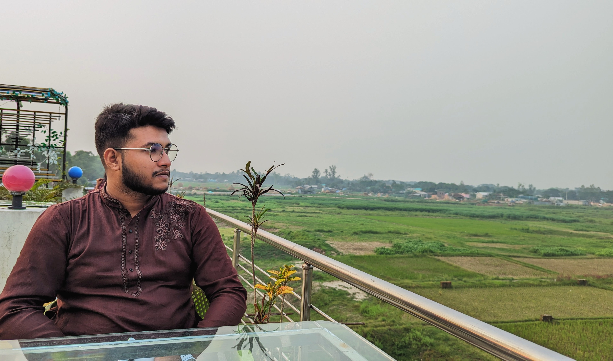

# <samp>&gt; Hi there, I'm <a href="https://www.linkedin.com/in/kamrjman" target="_blank">Kamrujjaman Tuhin</a>  </samp>

### Glad to see you here !
I am a full-stack web developer. I love programming, writing, speaking and traveling.

As a web developer, I enjoy using my obsessive attention to detail, my unequivocal love for making things that change the world. That's why I like to make things that make a difference.

- &nbsp;&nbsp; I'm currently working on something cool.
- &nbsp;&nbsp; I’m currently learning web development.
- &nbsp;&nbsp; Ask me anything about web development.
- &nbsp;&nbsp; How to reach me: kamrjman.kt@gmail.com

##  Tech Stacks

####  Programming Languages

####  Frontend Development

####  Backend Development

#### 🗄️ Databases & Storage

#### 🏃 Runtimes & Environments

#### ⚙️ Tools & Others

## 👨🏻‍💻 Contributions

    
  

## 📈 GitHub Statistics

 

  
 

 

  
 

 

  
 

 

  
 

